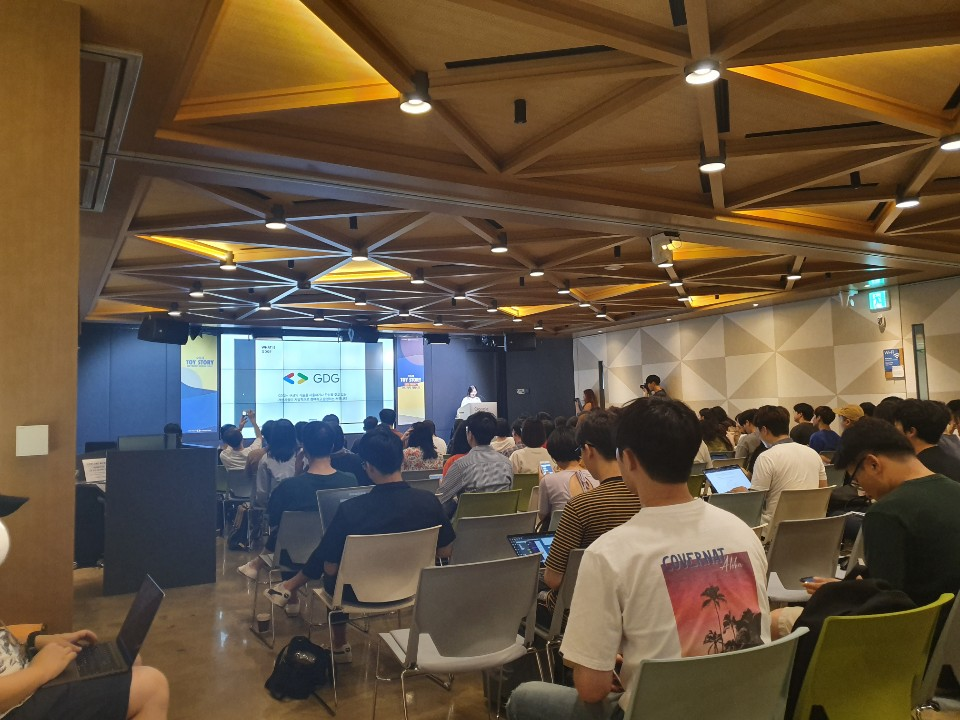
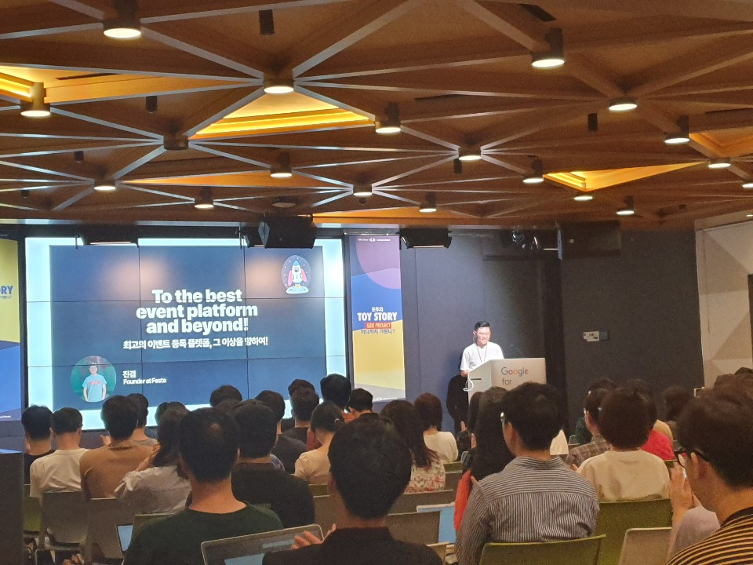
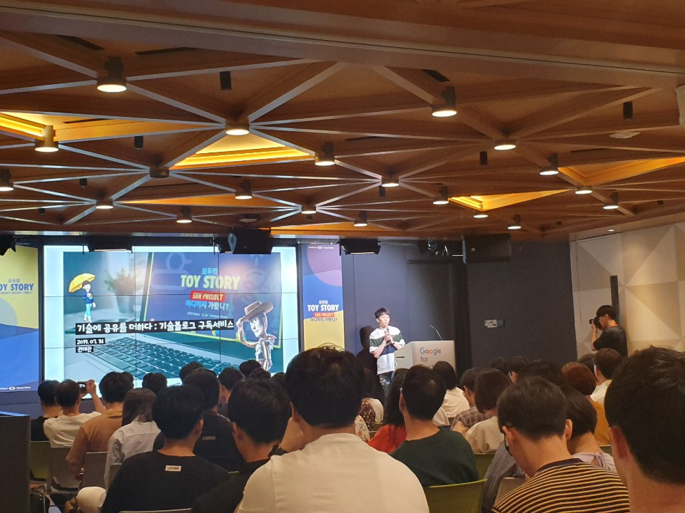
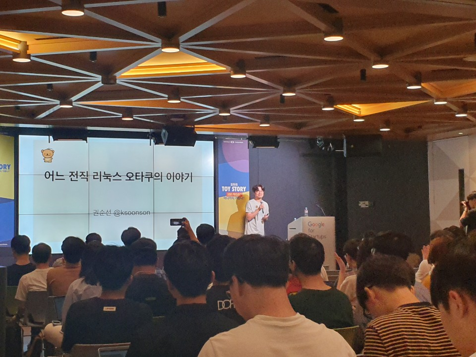
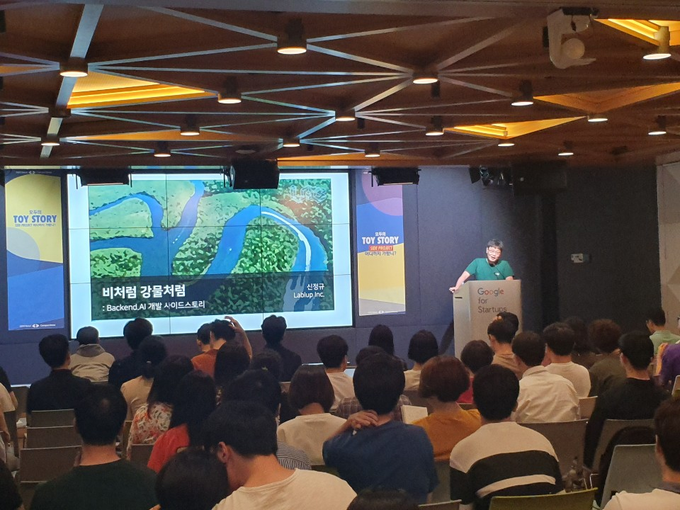
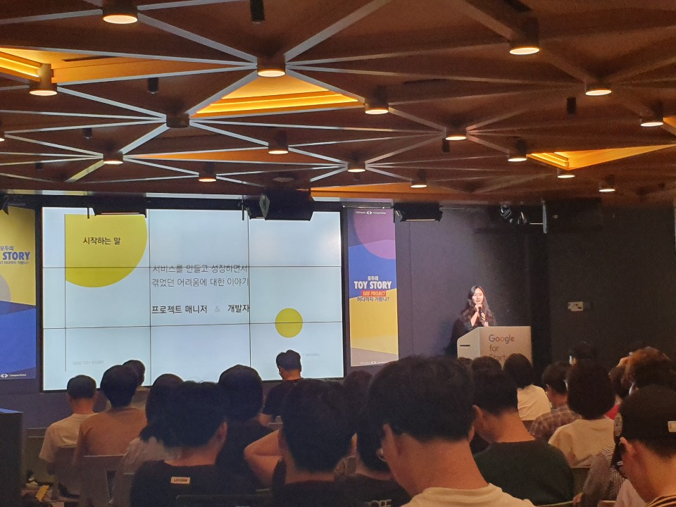
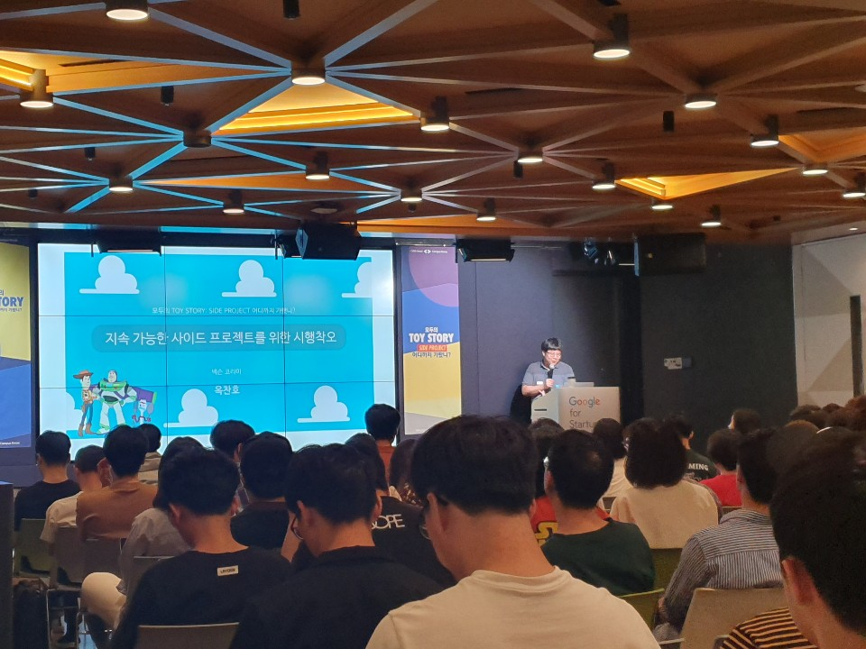
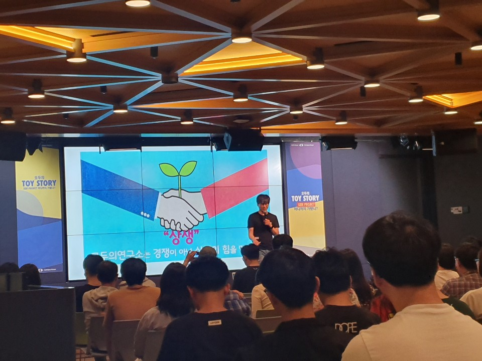
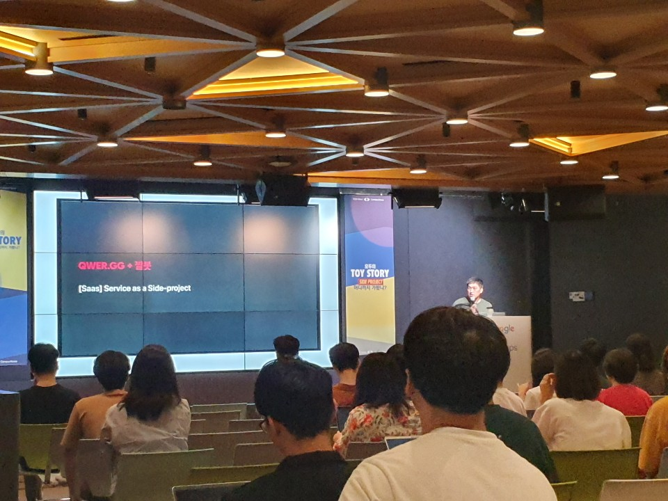

# 모두의 TOY STORY : Side Project 어디까지 가봤니? - by GDG Campus Korea

## GDG

각 지역을 중심으로 다양한 주제로 다양한 사람들이 참여하는 오픈 커뮤니티

## #1 최고의 이벤트 플랫폼을 향하여 , and beyond - 진겸

- Festa 프로젝트
  - 이벤트를 만나는 가장 쉬운 방법
  - 우리 서비스를 쓰는 자에게 최고의 경험을 주기 위함
  - 2017년도 개발
  - 처음에는 협업용 도구를 개발 하기로 했었음
  - 컨퍼런스를 위한 Jira를 만들어보자 라고 시작함
  - 써보고 싶은 기술을 마음껏 써보자
  - GDG에서 이벤트를 여는데 이벤트를 접수 받는 곳이 없었다
  - Pivot을 하기 위함
  - Ticketing Platform
  - 데드라인 1달
  - EDD 
    - Event Drven Development
  - 파이콘/아임포트에 결제 시스템 문의
  - 잘 진행되고 있는듯 했으나 기쁨도 잠시
  - 여행중에도 코딩을 진행
  - 오픈전에 많은 버그가 존재
  - 코드의 피드백을 받을수 없었음
  - 마지막 1주일은 밤샘 작업
  - 하루전에 오픈 알림이 와서 놀랐다
  - 결제를 완료한 화면을 보니 기분이 좋았다
  - 하지만 오류 화면도 보임
  - 회고.. 그리고 느낀점
    - 더이상 못하겠다
    - 회사를 열심히 다니자
  - 기술적 인사이트
    - 남들이 많이 쓰는 이유
    - 버전이 정해져 있으면 좋다
  - 스스로의 부족함
  - 협업의 어려움
    - 최고의 인재들을 모았지만.. 납득시켜야 한다
  - 지킬수 밖에 없는 데드라인 = 발전
    - 나는 나태하기 때문에
  - 제 2부 새로운 본격적인 시작 그리고 새로운 문제점들
    - 강의를 하려고 했으나 다른 곳에서 Festa를 사용하고 싶다고 요청이 들어옴
    - 다시 사람들을 모음
    - 처음부터 다시 만들자
    - MVP
      - 기간이 정해져 있지 않으면 안하게 된다
    - Slak + Jira + Github + Gsuite
    - 현실적 문제
      - 사업자 문제
      - 보증보험
      - 정산을 위한 기초 자본금
      - 비지니스 모델
    - 프로젝트 매니징의 어려움
      - 각종 슬럼프 + 빠른 번아웃
      - 프로젝트 접어야할 위기들
        - 책임감이 없어지는 순간 위기가 찾아온다
    - 계속되는 EDD
    - 사이드 프로젝트의 한계
      - 규모를 넘어가면 사이드프로젝트가 아니게 된다
      - 엄청난 인력/시간 부족
      - 나도 한번 해볼까?
      - 가볍게 시작한 프로젝트는 가볍게 끝난다
        - 지속성이 중요
        - 원동력이 있어야 한다
      - 프로젝트 축소
      - 시간을 무진장 더 쏟는다
    - 개발과 서비스는 다른 차원
  - 제 3부
    - The best way to find Events
    - 커뮤니티
    - 우리 서비스를 쓰는 자에게 최고의 경험을하기 위함
      - 이런거 까지 가능하네? 라는 감탄사가 나오게
    - 수익은?
      - 카드사가 많이 가지고감
      - 새로운 비지니스 모델을 찾는중
      - offline event coordinaion
    - Cutting Edge Tech
    - 사람을 뽑고 있는중
      - 최고의 경험을 주는 서비스를 만들고 싶은사람
      - 프로젝트 하나에 진득하게 투자 해보고 싶은 사람
      - 책임감이 있는 사람
      - 주체적인 사함
      - 로케트 탑승권 얻고싶은분
      - 모든 직군을 뽑고 있는중
      - 급한 인력
        - 문서화 좋아하는 PM
        - 서버와 데브옵스 잘하는분
    - 조금더 나은 프로젝트를 만들기 위해 노력

## #2 기술에 공유를 더하다: 기술블로그 구독서비스 - 권태관

- 오늘 7월 14일이 기술 구독서비스를 오픈한 날
- 네이버 백엔드 개발자
- VLIVE에서 채용
  - 트래픽이 많음
  - 연예인을 볼 수 있음
- 사이드 프로젝트
  - 회사에서 하는 업무와 별도로 진행
  - 개인 또는 팀으로 구성
  - 주제, 목표, 일정에 제한이 없음
  - 왜할까?
    - 내가 필요해서
    - 번뜩이는 아이디어가 있어서
    - 새로운 지식을 습득하기 위해서
  - 왜 만들었나?
    - SNS 챙겨보기 힘들어서 + 보다가 자꾸 딴짓해서
    - 다른 것에 집중하다 보면 중요한 정보나 좋은 글들을 놓쳐서
    - 다른 사람들의 글들을 보며 자극 받고 싶어서
    - 내 블로그를 홍보하고 싶어서
    - RSS리더 서비스를 직접 만들어보자!
- 기술블로그 구독서비스 소개
  - 메일을 등록하고 인증절차를 거치고 DB에 저장한 내용을 파싱하여 메일로 발송
  - awesome-devblog에서 정보를 가지고 옴
  - 개발을 뭘로 하지?
    - Java + Spring를 사용했지만 Python + Flask 를 사용
  - 서버는 뭘로 하지?
    - AWS
  - 개발을 1주일안에 완성후 SNS에 홍보
- 운영
  - 너무 느린 메일링
    - 수집후 발송하니까 느려서 수집을 미리 하고 발송을 하게 변경
  - 메모리 1G, CPU 1개.. 가난한 개발자?
    - 주어진 환경에서 최대의 성능을 만들어보자
      - threading 
      - multiprocessing
  - 메일 본문 에는 CSS, JS가 적용이 안된다
    - Emogrifer
  - 열심히 만들어 보넀는데 스팸?
    - 구글 SMTP : 하루에 500개 발송 제한
    - SMTP 서버를 구성하여 보내봤더니 스팸
    - 가장 깔끔하고 발송관련 모니터링이 가능했던 AWS SES를 사용
    - 피드백 기능으로 유효하지 않은 메일이나 수신거부 된 사용자 처리
  - 서비스를 만들었으면 모니터링을 해야지
    - 엘라스틱 서치를 사용중이 였지만 비용을 내야해서 따로 로깅시스템을 구축
  - 필터링, 카테고라이징, 태그
    - 본문의 형태소 분석을 해서 태그를 설정
  - 구독자 1000명 기념 새로운 기능 만들기
    - 양질의 글을 찾기 위해 주간 인기글 적용
    - 아카이브 페이지
  - 한살이 된 나의 프로젝트, 얼마나 컸니?
    - 운영기간: 만 1년
    - 크롤링 포스팅 수 : 약 9,000개
    - 구독자수: 약 1600명
  - 앞으로의 방향성?
    - 농부의 마음으로
      - 후원이 필요
    - 서비스 유지를 위한 후원
    - 기술블로그 홍보 및 포스팅을 장려하는 하나의 플랫폼으로
  - 하면서 무엇을 느꼈는가?
    - 강제 학습
    - 회사와는 별도 진행 서비스에 대한 책임감
      - 오전 10시만 되면 이제는 몸이 먼저 반응(메일이 잘 왔나..)
      - 경험으로 부터 나온 인사이트를 팀에서도 적용
  - 여러분의 토이스토리는 무엇입니까?
    - 넌 그냥 자신을 믿고 시작해보자

## #3 어느 전직 리눅스 오타쿠의 이야기 - 권순선

- KLDP
  - 96년 10월에 처음 만듬
  - ./ + sf.net 또는 SO + GitHub + Wikipedia
  - 계기
    - 여자친구랑 깨졌다
    - 뭔가에 집중해보고 싶다
  - 1999년도 야후를 배껴서 디자인
  - 2000년도 다음을 배껴서 디자인
  - 2001년도 디자인 개편
  - 2003년도 개편
    - 제일 잘 나가던때
  - 2004년도개편
    - 행사 진행
    - 해커톤 진행
  - 2005년도 개편
  - 2014년~ Now 개편
    -  php cms 솔루션으로 갈아탐
  - 2016년 10월 20주년 모임
- 경력
  - 결혼 + 아이
  - 회사
    - 삼성(1999 ~ 2007)
      - 2연속 진급 실패
      - 프로젝트 하느라 일을 못함
    - 네이버(2008 ~ Aug 22, 2011)
      - 네이버 개발자센터
      - nForge
      - 버닝데이/Deview
    - 구글(Sep 26, 2011 ~)
      - Korea
      - KR/JP/SEA/ANZ
      - KR/JP/CN/TW/HK/AMZ + Global
- 회고
  - 행운
    - Linux vs Delphi
      - 리눅스를 고른것이 행운
    - Developer Relations
  - 열심히
    - 4 * 365 * 8 - 4 * 30 * 2 = 11440
      - 하루에 4시간 이상 작업
      - 병특과 회사 합숙 빼고
    - 기숙사 전화선
    - 터미널
    - ADSL
    - PC방
    - 처가집
- 기술
  - 이것저것 하다 보면 문제가 많이 생김
  - 문제를 해결하다 보면 삽질을 함
  - 삽질을 하다 보면 깊이 파고 들어감
  - 파다 보면 스스로 해결이 안되는 문제가 생김
  - 기술 뉴스를 구독하여 읽음
  - 원서 책을 읽음
- 인연 & Credists
  - 많은 사람들과 작업

## #4 비처럼 강물처럼 BeckAnd API - 신정규

- Lablup
  - 왜 딥러닝 모델 구현이 어려운가?
    - 오픈소스 + 클라우딩 컴퓨팅 = 다 된건가?
      - 안됨
    - GPU 관리의 어려움
      - 표준화된 인터페이스를 제공하지 않음
    - 소프트웨어 관리의 복잡성
  - Beckend. AI 만드는 중
    - 엔터프라이즈 제품으로 수익

- 목차
  - 목이 나온 사람들
    - 거북목 증후군
      - 그게 플랜 B였습니다. 언제나 플랜 B를 만드세요. 언젠간 그게 플랜 A보다 낫다는걸 발견할 때가 있을겁니다.
      - 곰돌이 가족회의
        - 생활비 / 저축 관련
        - 전자기기 백업 및 보관, 판매
        - 방 관련 정돈
        - 어느 가족 회의 때..
          - 결혼 2.0
          - 그럼 목표는?
            - 연구와 창업을 위한 오피스 + 집
          - 후회를 남기지 맙시다
            - 애기도
            - 서비스 만들기도
            - 연구도
          - 동의를 얻었는데 이걸 진짜 해야 될까
      - TEXTCUBE
        - 좋은 많은 사람을 만나게 됨
        - 같이 창업 하자
      - 기술에 대한 이해
        - 알고 있는 분야
        - 경험이 풍부한가
        - 경험이나 연구에서 나온 강점이 있는가
      - 산업의 발전 과정 역사를 보자
      - 만들것
        - 거대 샌드박스 기반의 프로그램 코드 + 데이터 실행 서비스
        - 클라우드 기반 아키텍터
      - 안 지르면 영영 못 지를 것 같았다
      - 팀
        - 같이 계속 의견을 공유하던 텍스트 큐브 프로젝트 + 포스텍 동기
      - 창업
        - 첫 피치
          - 흑역사
            - 피치하는 자리인 줄 몰랐음
            - 왜냐면 IR을 하라고 해서 갔기 때문
          - 준비 없이 갔지만 소득이 있었다
            - 백 번 절을 해야 하는 자리 였음
        - 첫 공개
          - 파이콘 KR
  - 살이 하얀 사람들
    - 가치 평가
      - 우리의 시장 가치 목표 1140억(이 수치를 믿으면 안된다)
    - 첫 워크샵
      - PC방
    - 첫 공식 출시
      - 15년 11월 4일
    - 하지 말아야 했던 것들
      - 하드웨어를 만들어 2대 팔았는데 안하기로 함
        - A/S문제
      - 컨설팅
        - 딥러닝 모델 컨설팅
        - 챗봇 시스템 설계 컨설팅
        - 뇌데이터 연구 과제
        - 돈은 되지만 회사의 가치를 올려주지 않았다
      - 공통점
        - 할 수 있는것 + 수익이 나는 것
      - 문제점
        - 그게 창업의 목표는 아니 였다
    - 기술 스타트업의 기회들
    - 래블업의 시장 예측
    - 결정의 순간
      - 학교 /연구소
        - 편한 도구를 주면 실력이 늘지 않는다
      - 기업
        - 똑같은거 만들고 있음
    - 정식 IR
      - 첫 IR 자리에서: 모든 일에는 처음이 있다
        - 1시간 동안 설명을 들음
      - 네 번째 IR 자리에서 : 모르면 바로바로 물어보기
        -  SI
          - 시스템 통합
          - 전략적 투자자
    - 없음의 미학
      - CI도구 : 창업 시작때 자체 개발
      - 시드 머니가 바닥나 갈때
        - 개인 시놀로지에 Docker 시놀로지 올림
        - 클라우드로 비싸다 -> 시놀로지 Drive로 이동
      - 회사에 돈이 떨어지면 알게 되는 것들
        - 엄청난 유혹들과
        - 동료들의 확신의 정도와
        - 딸각발이 정신
  - 눈 밑이 검은 사람들
    - 진작 해야 했던 것들
      - GUI가 있었어야 함
      - 해외 컨퍼런스 홍보 및 발표
      - 대규모 클러스터 설치 도구 개발
      - 클라우느 SasS 런칭
    - GUI
      - 아는 만큼만 보인다
        - 설치 방법도 다양하게 지원
      - UI 개선
        - CLI에 정보를 더 많이
      - 2019년 2월에 개발 시작
    - 해외 컨퍼런스
      - 기술 발표는 몇번 나갔음
      - 우리 위치가 어느 정도인지 제대로 한 번 알아보자
      - 발표 신청 / 부스 신청
      - 결론
        - GUI를 대충이라도 만들어서 들고 오길 잘했다
        - 기술적으로 우리가 최전선에 있더라
        - 가치 판단 기준의 국내와 국외가 완전히 다르더라
    - 설치 프로그램
      - 메뉴얼 있으니까 다들 설치 잘 하겠지?
      - 현실은 설치하기 어려움
      - 개발자용 install 스크립트 만들기
      - Ansible 대응
      - 가상머신 이미지 제공(해야함)
    - 끝마치며
      - 현재의 행동은 외외로 미래의 나에게 영향을 미칩니다
        - 무엇을 하게 될 지 모르더군요
        - 계획대로 가는 삶은 없는듯 합니다
      - 만드는 시간 만큼 사용하는 사람을 만나봅시다
        - 개밥 먹는걸로 같은 개들만 좋아하더랍니다
        - 고양이도 만나고 돌고래도 만나야
      - 시작한 후에 끝날 걱정을 미리 하지 맙시다
        - 기술을 멀리 예측하듯이 살도 길게 관조하시면 눈 앞에 집중할 수 있습니다
        - 시작도 안 했으면 끝 걱정도 못 해봤을 거에요

### #5 눈누의 노란 사춘기 - 윤민지, 이찬하

- 무료의 한글 폰트를 모아 놓은 서비스
  - 라이센스
- PM
  - 초보 PM
  - 원래 디자니어 및 프론트 개발자
  - 원래 하려고 한건 아닌데..
  - 프로젝트가 성장하면서 생기는 문제
    - 오류 대응 미숙
      - 갑작스런 성장
        - 시작부터 열광적인 반응
        - 다양한 채널에 노출
        - 갑작스러운 이용자수 증가
      - 작년 3월에 오픈
      - 실수로 생긴 오류에 대응하지 못하는팀
        - 외부에 도움 요청
        - 반복되는 오류
        - 반복되는 대응 미숙
        - 반나절 동안 사이트가 다운
        - 아, 뭔가 잘못 됐다!
      - 어떻게 해결
        - 능력 있는 팀원을 들이자
        - 크루 모집 공고
        - 새로운 팀원 합류 후 외부의 도움 없이 내부에서 문제를 잘 해결되는 듯 했으나..
    - 운영비
      - 시작할때 멋쟁이사자처럼에서 받은 1000 creditd을 1년만에 다 써버림
      - 1년 후 30만원 남음
      - 3개월 시한부
      - 돈을 충당
        - 비정기적으로 돌아오는 이용자의 소소한 후원금
          - 3천원 ~ 11만원 사이에서 들어오는 불안정함
        - 비정기적으로 하는 크라우드 펀딩
          - 펀딩에 실패하면 샘플 제작비만 날리고 수익 0원
      - 후원사를 유치
        - 두 곳의 후원사 유치 성공
      - 지출 관리
        - 아낄 수 있는 건 아끼고
          - 과다하게 설정된 용량 줄여서 월 25$ 서버비 절감
          - 불분명한 지줄처 확인해서 불필요하면 없애기
        - 쓰면 좋은 데엔 투자하고
          - Jenkins 사용
          - 홍보용 굿즈 제작
        - 비용 문제는 미리미리 생각 해야한다
      - 다음 단계 준비
        - 타이포 디자이너를 위한 폰트 마켓(예정)
        - 온라인 명한 제작 서비스 눈카드
          - 눈누에 있는 폰트를 이용해서 명함제작
        - 눈누 폰트를 이용한 메시지 카드 앱(예정)
    - 정리
      - 팀이 서비스를 감당 못한다고 판단되면
        - 신중하고 빠르게 팀원을 충원하도록 하자
      - 자금 문제는 미리미리 준비하자
        - 안일하게 생각했다간 밑도 끝도 없는 마이너스
- 개발
  - 부채
    - 기술 부채
      - 기술적인 문제를 뒤로 미루고, 비즈니스 문제 해결을 앞당김
      - 땡겨쓸 떈 편하지만, 부채에는 이자가 붙습니다
    - 원인
      - 개발자의 숙련도 부족
        - 코드가 불러올 결과를 예상하지 못함
      - 사이드 프로젝트의 한계
        - 문제에 대해 진지하게 오래 고민하지 못하고 본업으로
      - 항상 급박한 상황
        - 우선 빨간 화면은 안보이게 고치고 생각하자
    - 결과
      - 개발자의 의욕 저하
        - 해결되지 않는 오류의 늪에 빠짐
      - 서비스가 더 상장하지 못함
        - 기능이 추가되지 않으면 귀신같이 정체되는 MAU
      - 더이상 해결되지 않는 문제
        - 여기를 고치니까 이제는 저기가 터지기 시작
    - 해결 방법
      - 2.0 개발
        - 각자 잘하는 or 하고 싶은 부분을 주도해서 만들어보자
    - 역할 분담
      - 본업에서 쓰는 스택 위주로 담당
    - 일정 관리
      - 구글 시트
    - 느낀 점
      - 사실 빛을 안지고 살 수는 없다
      - 적절한 상환 계획이 매우 중요
    - 2.0은 9월에 완공 예정

## #6 지속 가능한 사이드 프로젝트를 위한 시행착오 - 옥찬호

- 사이드 프로젝트 소개
  - RosettaStone
  - C++
  - 팀원이 안뽑힘
  - 하스스톤 개발자를 만나기도 함
- 새로운 팀원을 맞이하기
  - 프로젝트의 규모가 커지면 혼자서 감당하기 어렵다. 그래서 프로젝트를 같이할 새로운 팀원을 찾게 됩니다
  - 그런데 사이드 프로젝트란..
  - 많은 기술을 사용할꺼 같지만 아니다
  - 열정이 있어 프로젝트에 참여하려고 들어온 팀원들이 막상 개발을 하려고 하니 구조를 이해하는데 어려움을 겪어 포기하는 경우를 많이 봤었습니다
  - 문서화가 필요
  - 새로운 팀원이 프로젝트의 구조를 이해하고 기여할 수 있도록 도와줘야 한다. 팀원들이 스스로 무언가를 할 수 잇는 궤도에 오를 떄 까지
  - 그러기 위해서는 다음 사항을 준비
    - 듀토리얼 문서
    - 예제 코드
    - API 문서화
    - 프로젝트에 기여하는 방법
  - 문서화를 영어로 만드니 팀원이 생김
- 각자의 마음속은 동상이몽
  - 프로젝트를 더 좋게 만들고 싶은 마음은 팀원들 모두 똑같습니다. 문제는 '어떻게 좋게 만들 것인가'에 대해 갖고 있는 생각이 다르다는 것이죠
  - Master 브랜치의 핵심 구조를 바꿈
    - 서로 구조가 꼬임
    - 서로 생각하는게 다르다 보니 어떤 팀원이 다른 브랜치에서 작업하고 나서 master 브랜치에 머지하고 나면 코드 구조가 달라짐
    - 그러다 보니 충돌이 자주 발생/ 작업하던 코드를 전부 다시 작성
    - 이런 일이 몇번 일어나고 나니, 작업 인원들이 서로 지치게 되고 급기야 팀원 간에 오해가 생겨 프로젝트에 위기가 찾아오 게 된다
    - 이 문제를 해결하기 위해 우리가 한 일
      - 온라인 4시간, 오프라인 4기안 얘기후 한가지로 통합
      - 적어도 1달에 1번은 오프라인으로 모여서 프로젝트 진행 상황을 공유하고 앞으로 할 인을 논의하자. 그래야 앞으로 이런 일이 발생하지 않을 것이다
      - 질문이 있거나 논의하고 싶은 내용이 있을 때마다 언제라도 이야기할 수 있는 공간을 마련하자
        - 채팅방 마련
      - 대화를 많이 하자
- 프로젝트 관리의 기준선
  - 사이드 프로젝트를 유지하기 위해서는 프로젝트 관리에 최선을 다해야 한다
  - 사이드 프로젝트가 잘 유지되고 있는지 어떻게 판단
    - 프로젝트가 잘 빌드되고 있는가?
    - 꾸준히 커밋이 되고 있는가?
    - 프로젝트의 코드 스타일에 일관성이 있는가?
    - 프로젝트의 코드 품질은 잘 관리되고 있는가?
    - 프로젝트를 사용하기 위한 문서가 있는가?
  - 빌드가 잘 안되는 경우가 많다
    - 빌드가 안되면 안쓴다
  - 프로젝트의 코드 스타일에 일관성이 있어야 하는 이유
    - 통일성 있게 사용할 수 있게 장치가 있으면 좋다
  - 정한 방침 : 누구나 관심이 있으면 팀에 들어올 수 있게 하자. 하지만 프로젝트의 관리의 기준선을 아주 높게 만들자
    - Windows/Linux/macOS에서 빌드가 안되면 머지 불가능
    - 코드 품질이 일정 수준을 만족하지 않으면 머지 불가능
    - 테스트 커버리지를 충족하지 못하면 머지 불가능
    - 코드 리뷰를 거치지 않으면 머지 불가능
- 정리
  - 사이드 프로젝트에서 지속성은 가장 중요한 요소
  - 새로운 팀원이 궤도에 잘 오를 수 있도록 든든한 조력자가 되어주세요. 더불어서 처음 시작하는 사람을 위한 가이드를 만들어주세요
  - 팀원들이 서로 논의할 수 있는 공간/시간을 만들어주세요. 같은 방향을 바라볼 수 있게요. 온라인, 오프라인 둘다 좋습니다
  - 프로젝트 관리의 기준선을 세우세요. 이 기준선은 정하기 나름
    - (기준선이 매우 높은게 좋다고 생각)

### #7 모두의 연구소 : 경쟁이 아닌 상생의 사회를 꿈꾸며 - 김승일

- 어릴 때는 하고 싶었던게 많았다
- 하지만 나중에는..
- 어릴때 공룡을 좋아했지만 나중에 공룡박사가 되지 않는다
- 입시교육에서 필연적으로 등장하게 되는 사교육
- 우리나라의 교육은 본인이 하고 싶은것을 고르지 못한다
- 하고 싶은 게 있는 아이들이 효자/효녀다
- 대학 입학
- 취업
  - 안짤리고 다닐려면 아무것도 안하면 된다
  - 하지만 퇴사할 때 할 줄 아는게 없다
- 모두의 연구소
  - 누구나 연구소를 만들수 있다
  - 누구나 참여할 수 있다
  - 어떻게 시작
    - 친구가 '개발자 카페를 만들어 보고 싶어'
    - 하고 싶은 프로젝트를 함께 하는 곳이 을 만들자
    - 그런데 진짜로 하고 싶은 걸 할 수 있을까?
    - 그걸 우리가 서포트 할 수 있을까?
    - 우리가 해보자
      - 드론
        - 만드는 방법을 블로그에 올림
        - 구글 검색하면 1페이지에
        - 수많은 강연 요청
        - 책을 한권 쓰고
        - 쇼핑몰도 하나 만들어봄
    - 주변의 반대
      - 요즘 세상에 무슨 오프라인 서비스냐
      - 왜 거기까지 와서 연구를 하겠냐
      - 처음에 모인다고 한들, 그 다음부터는 밖에서 따로 만나지 않겠냐
      - 어차피 망할거 빨리 해보고, 빨리 망해서, 빨리 다른거 하렴
    - 부인
      - 딱 1년만 해보고 안되면 다른 거 할께 
      - 자본금 다 날리면 그 순간 그만할께
      - 긍적적인 피드백
        - 어 재밌을 거 같은데 한번 해봐
    - 2015.08.10 공간대여점에서 시작
  - 처음에 3개의 연구실 15명의 연구원
    - DeepLAB
    - 나 혼자 난다
    - VRTooN
  - 시련
    - 첫번째 시련
      - 2015.11월 공간대여점에서 쫓겨남
      - D.CAMP 무료로 한달 사용
    - 두번쨰 시련
      - 하고싶댜 != 할줄안다
      - 하고싶어하는 사람과 함께할 것인가?
      - 할줄아는 사람과 함계한 것인가?
      - 상생하는 문화가 생김
        - 본인이 잘하는 분야를 공유
    - 세번째 시련
      - 할 줄을 모르다 보니 자꾸 스터디 모임을..
      - 그래서 풀잎School
        - 모두 공부를 하고와서 스터디
  - 이제는 50여개 연구모임 400여명의 멤버쉽 연구원들이
  - 어느덧 스타트업이 두개나..
  - 여러 대회에 참가
    - 지문 인식
  - 여러가지 프로젝트가 나옴
    - 비접촉식 호흡 측정기
  - 9권의 책
  - 다양한 전시활동
  - 감사의 말씀
  - 이러한 사랑을 어떻게 나눠줄까
    - 돈을 쓰면서가 아닌, 돈을 벌면서 취업을 준비하는 Meani.mo 프로젝트
    - 교육을 미래의 꿈꾸기 위한 노력
      - 해외 교육 기관 탐방

## #8 [Saas] Service as a Side project - 김석준

- 프로젝트

  - MINIMO
    - 메모
  - PixelBracelet 
    - LED 팔찌
  - Raspilight 
    - 인터렉티브 조명
  - 다이어트 다이어리
    - 운동 저널
  - 이웃
    - 동네 소식 앱
  - 트릿
    - 동물병원 레이팅 앱
  - 등등

- 왜?

  - 애초에 개발자를 하고 싶은 마음이 없었음
  - 앱 열풍과 함께 스타트업에 뛰어 들었으나.. 망함
  - 비 개발자 출신의 한계
  - 정부 지원 사업 -> 외주 -> 정부 지원 사업 -> 외주
  - 그래 내가 만들자
  - 만들고 싶은걸 만들 수 있다는 것이 개발자의 가장 큰 장점

- 인사이트

  - 하드웨어는 하지 말자
    - 부품 구매/배송/관리 비용이 큼
    - 프로토타입과 제품의 거리가 멈
  - 앱은 하지 말자
    - 개발은 하겠는데 배포가 지옥
      - 그리고 나는 웹 개발자인데
    - 더큰 문제는 천신만고 끝에 배포를 해도 다운로드를 안받음
  - 내가 좋아하고 필요한 걸 하자
    - 의미있는 걸 찾다보면 현자타임이 심하게 옴
    - 돈 될거 같아서 해 봐야 아무도 안옴

- 짤봇

  - /짤 - 기본 기능
  - /짤추가 - 팀에서만 쓰고 싶은게 있을때
  - /짤봇 -도움말이 필요하더라
  - 어떻게
    - 짤 크롤링
      - API를 그대로 오픈해놓은 곳이 태반
      - 확장성이 없어 그때 제대로 만들걸 하고 후회
    - UI
      - 슬랙 Slash Command 가 잘 되어 있음
      - 배포는 개발한지 2년만에. 앱 등록이 귀찮음
    - 기타
      - 설계고 뭐고 일단 되게 하자
      - 비용이 얼마나 나오겠어
  - 빌드
    - 빌드를 자동화 하고 싶은 -> 젠킨스
    - 사량이 낮으면 느리고, 계속 켜놓으면 돈나감 -> 고사양으로 쓸때만 켜 놓음
    - 설치하고 세팅하는거 귀찮음 -> Bitnamit로 사용
  - 사용자
    - 11번가, 아프리캈V, PUBG, 샌드박스 네트워크등 150여개팀에서 사용
    - 뭐하는데인지 모르는데가 태반

- 런칭

  - 2018년 2~3개 서비스를 만들었는데 런칭을 못했음
  - 다 만들고 본의 아니게 접게 됨

- QWER.GG

  - 왜?
    - LCK 개막이 다가오는데 best.gg 가 운영을 안함
    - LoL 공식 웹사이트 거의 사용할 수 없는 수준임
    - 어디서 중계하는지도 모르겠고, 언제 하는지도 모르겠음
    - 만들어야겠다
  - 무엇을
    - 일정을 볼 곳이 없으니까 저장해놓자
    - 경기 할때가 되면 알려줬으면
    - 트위치나 유툽 라이브도 볼 수 있게 해야지
    - 경기 결과도 넣어서 랭킹도 변하게 봐야지
  - 개발자는 반복을 싫어함
    - 크롤링을 해야 겠다고 생각함
    -  API를 찾아봤는데 없음
    - 뒤져서 소스를 확보함
  - 홍보
    - 입네에 지인이 공유해 줌
      - 그 사람이 이제 제 PM
    - 유툽으로 해설자에게 (빛돌) 연락을 함
      - 직접 만나서, 여러가지 피드백을 받음
    - 여러가지서 연락옴
  - 요청
    - 내 니즈는 다 실행헀는데 뭐하지?
    - 경기 데이터를 사람들이 보고싶어함
      - 아이템, 빌드, 룬 같은 것들
    - 국제 리그에 나오는 팀들 뭐하는 애들인데?
      - 전세계 리그를 다 긁어버리자
  - 우리는 어떤 사람인가
    - 손으로 매치/빌드 데이터를 넣다가 이것도 크롤링
    - 공짜 트래픽을 위한 SSR, SEO
    - 운영/테스트 해 줄 사람이 없으니 데이터라도 쌓자 sentry, ga
    - log를 slack 에 쌓으면 언젠가 보겠지
    - 로그를 slack으로 보내기를 추천
  - 현재
    - 유저 10~12k / 1개월
    - 데이터 분석을 통한 지표 생성 및 승률 예측 개발중
    - 키보드/마우스 스폰서
    - RiotGames API를 받음 (잘 안줌) - 선수 그리고 나
    - LCK 상위권 팀과 데이터 관련 파트너쉽 (매출?)

- CI/CD

  - 짤봇을 방치했다가 1년반만에 다시 잡았는데
  - 큰 무리없이 다시 시작할 수 있었음

- 디자인

  - 디자인이 없으면 서비스는 불가
    - 못하는건 아닌데 뭔가 힘이 안나고 지속이 안됨
  - 디자인이 필요없는 UI를 선택하던가
    - 슬랙이나
    - 요즘엔 트위치 앱도 재밌을거 같음
  - 디자이너와 협업하자
    - 커뮤니케이션을 못하는게 자랑이 아님
    - 이건 언젠가 말할 기회가 있었으면

- 주제

  - 내가 좋아하고 내가 필요하면
  - 남들도 좋아하고 남들도 필요하다
  - 가급적이면 크롤링이 가능한 주제로

- 팀

  - 친한 사람들을 꼬시되 큰 기대는 하지 말자
  - 내가 못하는 걸 채워줄 수 있는 사람이 좋음
  - 느슨하게 오래가는 팀이 좋음
  - 서로에게 모티베이션을 줄 수 있는 방향을 찾고 있음
  - 재밌게 지내도록

- 기술

  - 부트업 시간이 짧은 기술을 선택
  - 피처 개발이 쉬운 기술을 선택
    - 기능 하나 개발하는데 디펜더시가 많으면 안됨
    - RDBMS는 가급적이면 피하자
    - 원래 개발하고 설계는 나중에 하는 거임
  - 단순한 구조를 최대한 유지
  - 데이터 >>>>> 개발시간 >>>>> 성능
  - 새로운 기술은 적어도 파운더는 고르면 안됨
    - 아는 것만 하고 모르는 건 최대한 뒤로 미루기
    - 배움이 끝나면 모티베이션이 급격하게 하락할 수 있음

- 워크 / 사이드프로젝트 밸런스

  - 하루 4-7시간 정도 하다보니 잠이 부족
    - 리모트라 가능했음
  - 쉴땐 쉬자
  - 자동화가 핵심
  

  

