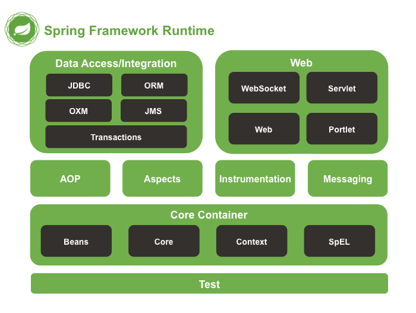

# Spring Framework 개념

## 대상

- 스프링 애플리케이션을 개발한 `경험이 있는` 개발자.
- 스프링 애플리케이션을 개발한 `경험이 없는` 개발자.
- 스프링 애플리케이션을 개발할 `예정이 있는` 개발자.

## 교육 목표

- 스프링 프레임워크의 핵심 개념에 대해서 설명합니다.

## 프레임워크 (Framework)

- 일반적인(generic) 기능을 제공하는 추상화 계층,
- 더 큰 소프트웨어 개발 플랫폼의 일부로서 특정 기능을 제공
- 보편적(universal)이고, 재사용가능(reusable)한 소프트웨어 환경
- 선택적으로 사용자가 작성한 코드로 변경이 가능
- e.g. Spring MVC, Spring Batch, Spring Data Framework
- https://en.wikipedia.org/wiki/Software_framework

## Framework vs Library 01

- 의존성 역전 원리IoC(inversion of control)
  - 디자인 원리(Principle)
  - 낮은 결합도(Loose coupling)
  - 라이브러리와 프레임워크 차이
- 기본 동작
- 확장성
  - 프레임워크가 열어둔 기능에 대해서 사용자는 오버라이드할 수 있다.

## Framework vs Library 02

> Framework = Design Pattern + Library

## 왜 Spring Framework 인가?

- 생산성
- 품질
- 사실상 표준인 (Defacto) Java 프레임워크
- 엔터프라이즈 애플리케이션에 적합한 Java 프레임워크
  - 엔터프라이즈 애플리케이션이란?
  - Spark framework
  - Vert.x framework
  - Play framework
  - Netty framework

# Spring Framework 기능

## EJB와 Spring Framework - 01


- Yann Caroff: co-founder of Spring Framework

> Spring: a new beginng after the "winter" of traditional J2EE

## EJB와 Spring Framework - 02

- `비침투적(non-intrusive)인` 프레임워크
- `POJO(Plain Old Java Object)`
- 오픈소스
- 경량(Light weight) 솔루션
- 모듈러 (Modular) 프레임워크

## EJB와 Spring Framework - 03


## Spring Framework 특징 - 01

- 경량 컨테이너로서, Spring Bean 을 직접 관리한다.
  - Spring Bean 객체의 라이프 사이클을 관리한다.
  - `Container` - Spring Bean 객체의 생성, 보관, 제거에 관한 모든일을 처리한다.
- POJO(Plain Old Java Object) 기반의 프레임워크.
  - 일반적인 J2EE 프레임워크와 비교하여, 특정한 인터페이스를 구현하거나 상속을 받을 필요가 없다.
  - 기존에 존재하는 라이브러리를 사용하기 편리하다.

## Spring Framework 특징 - 02

- 제어 반전 패턴(IoC : Inversion of Control)
  - 의존성 주입(DI : Dependency Injection) 구현 방법 사용
  - 낮은 결합도로 인한 DDD, TDD와 같은 프로그래밍 개발론에도 적합함.
- 관점 지향 프로그래밍(AOP : Aspect-Oriented Programming)을 지원.
  - 복잡한 비지니스 영역의 문제와 공통된 지원 영역의 문제를 분리할 수 있음.
  - 문제 해결을 위한 집중.
  - e.g. Transaction, Logging, Security and etc.
- 영속성과 관련된 다양한 서비스 지원.
  - e.g. MyBatis, Hibernate, JdbcTemplate 등등
- ***높은 확장성 및 범용성 그리고 Eco System***


# Spring Framework 모듈과 & 프로젝트들

## Spring Framework 모듈 - 01



## Spring Framework 모듈 - 02

- Core Container

| 모듈                   | 설명                                                         |
| :--------------------- | :----------------------------------------------------------- |
| spring-core            | Spring의 핵심 유틸리티가 포함된 모듈                         |
| spring-context         | Spring의 ApplicationContext 클래스들, 스케줄링 클래스들, AOP 관련 클래스들, Cache 관련 클래스들을 제공한다 |
| spring-context-support | Third-part 라이브러리를 통합하여, Spring ApplicationContext 에서 사용하기 위한 클래스들을 제공한다. Quartz, Guava, Ehcache 등과 관련된 클래스들 |
| spring-beans           | Spring Bean 과 관련된 클래스와 어노테이션들을 제공한다.      |
| spring-expression      | Spring Expression Language (SpEL) 관련 기능을 제공한다.      |

## Spring Framework 모듈 - 03

- AOP

| 모듈           | 설명                    |
| :------------- | :---------------------- |
| spring-aop     | Proxy-based AOP support |
| spring-aspects | AspectJ based aspects   |

## Spring Framework 모듈 - 04

- Data Access/Integration, Web, Test

| 모듈             | 설명                                         |
| :--------------- | :------------------------------------------- |
| spring-jdbc      | JDBC 관련, DataSource 도 포함                |
| spring-jms       | JMS 관련, JMS 메시지 관련 헬퍼 클래스들 포함 |
| spring-messaging | 메시징 아키텍처와 프로토콜을 포함            |
| spring-orm       | JPA, Hibernate 관련                          |
| spring-oxm       | Object/XML 맵핑 관련                         |
| spring-test      | 유닛테스트 관련                              |
| spring-tx        | 트렌젝션 관련                                |
| spring-web       | 웹 관련 모듈, e.g. RestTemplate              |
| spring-webmvc    | MVC 형태의 웹 서비스 관련                    |
| spring-websocket | 웹 소켓 관련                                 |

http://docs.spring.io/spring/docs/current/spring-framework-reference/html/overview.html

## Spring Project 소개 - 01

- `Spring Boot`
- Spring Framework
- Spring Cloud DataFlow - 메시징 교환 e.g. SEDA(Staged, Event-Driven Architecture) 구축
- Spring Cloud
- Spring Data - JPA, MongoDB, Redis, Elasticsearch ...
- Spring Integration - Enterprise Integration Pattern
- Spring Batch
- Spring Security
- Spring HATEOAS - Hypermedia As The Engine Of Application State
- Spring AMQP
- ...

https://spring.io/projects

## Spring Project 소개 - 02

### 스프링 부트와 스프링 프레임워크는 무엇이 틀린가?

### 스프링 부트 쓰세요

### 하지만 잘 아세요?

# IoC/DI

## IoC/DI 개념 - 01

> 하나의 클래스가 다른 클래스의 메소드를 사용하는 관계를 의존성(Dependency)라고 한다.

- 객체 지향 프로그래밍의 개념
- 아래의 NotificationService 클래스는 SmsSender 클래스에 의존관계를 갖는다.

```java
public class NotificationService (
    public boolean sendNotifiacation(User user, String message) {
        SmsSender smsSender = new SmsSender();
        smsSender.setEndPoint(...);
        smsSender.setPort(...);
        smsSender.setTimeout(4000L);
        return smsSender.sendText(user.getPhoneNumber(), message);
    }
)
```


### Questions

- Q1. SmsSender 는 더 많은 데이터가 필요합니다. 그러면 NotificationService 는 어떻게 변경하나요?
- Q2. 사용자 요구 사항은 항상 간단한가요?
- Q3. 실제는 위와 같이 간단하나요?
- Q4. 오래된 시스템은 어떤 상태인가요? - 스파게티 코드, 장황한 코드들의 나열
- Q5. 테스트 코드를 작성할때 쉽나요?

## IoC/DI 개념 - 02

- IoC
  - 제어의 역전 (Inversion of Control)
  - Don't call me, I'll call you
  - 패턴
- Dependency Injection (DI)
  - DI = `D`ependency `I`njection
  - Object 간의 의존성을 낮춘다.
  - 외부에서 객체를 생성하고 전달한다.
  - 구현

## IoC/DI 개념 - 03

- Q. DI 말고는 IoC가 없나요?
  
- A. 스프링 프레임워크는 IoC 패턴을 구현하기 위해서 DI Container 를 사용합니다.

## IoC/DI 개념 - 04

- DI (Dependency Injection) 정의

> 프로그래밍에서 구성 요소간의 의존관계가 소스코드 내부가 아닌 외부의 설정파일 등을 통해 정의되게 하는 디자인 패턴 중의 하나

- DI는 디자인 패턴이다. 핵심 원칙은 의존성 이슈로부터 행동(behaviour)를 분리시키는 것이다.
- DI는 IoC의 구현일뿐이다.

## IoC/DI 개념 - 05

- 행동을 정의하자. -> 문자를 보낸다 -> sendText
- 행동을 책임질 객체를 선정하자.
- Sender 라는 역할(Role)을 만들 수 있다.
- 추상화를 하면.. Sender 라는 interface 로 추상화 할 수 있다.

```java
public class NotificationService (
    private Sender smsSender;

    public boolean sendNotifiacation(User user, String message) {
        return smsSender.sendText(user.getPhoneNumber(), message);
    }
)
```

## IoC/DI 개념 - 06


- NotificationService 와 SmsSender 사이의 `코드의 의존성`은 없어졌음
- NotificationService 와 SmsSender 사이의 `실행의 의존성`은 그대로 유지된다.
- 유연, 확장 가능한 코드

## IoC/DI 개념 - 07

```java
public class NotificationService (
    private Sender smsSender;

    public boolean sendNotifiacation(User user, String message) {
        return smsSender.sendText(user.getPhoneNumber(), message);
    }
)
```

> Q. 구현체가 없는데 어떻게 동작하나요?
> A. Spring ApplicationContext.

## IoC/DI 개념 - 데모

```shell
git clone feature/demo_dependency_injection
```

`classicalStyle()` vs `dependencyInjectionStyle()`두 메서드의 구현이 어떻게 다른지 비교해봅시다.

## IoC/DI Spring Framework - 01

- 기억해봅시다.
  

## IoC/DI Spring Framework - 02

- 컨테이너

> ApplicationContext
> BeanFactory

- 스프링 빈

> Java 객체

## IoC/DI of Spring Framework - 03

- `org.springframework.context.ApplicationContext` interface represents the **Spring IoC container** and is responsible for **instantiating, configuring, and assembling the beans** by reading configuration metadata


- 다시 말하면 Spring Bean 을 생성하고. 파기하고, 조합한다.
  - What is Spring Bean?

## Spring Bean

```markdown
an object that is instantiated, assembled, and otherwise managed by a Spring IoC container
```

- Spring Bean 은 name, type, object 로 구성되어있다.

### cf.) JavaBeans

- public default (no argument) constructor
- getter/setter
- implement java.io.Serializable

### Spring Beans ≠ JavaBeans

# ApplicationContext

## ApplicationContext - 01

> `central interface` within a Spring application for providing configuration information to the application

- `Bean factory methods` for accessing application components.
- The ability to `load file resources` in a generic fashion.
- The ability to `publish events` to registered listeners.
- The ability to `resolve messages` to support internationalization.
- Inheritance from a parent context.

## ApplicationContext - 02

- ~Xml~ApplicationContext
- ~AnnotationConfig~ApplicationContext
- ~Groovy~ApplicationContext
- ~Web~ApplicationContext

## ApplicationContext - 03

- 전 Spring MVC 프로젝트를 했는데 ApplicationContext 를 본적 없어요.
  - webapp/WEB-INF/web.xml

```xml
    <context-param>
        <param-name>contextConfigLocation</param-name>
        <param-value>classpath:spring/applicationContext.xml</param-value>
    </context-param>

    <listener>
        <listener-class>org.springframework.web.context.ContextLoaderListener</listener-class>
    </listener>
```

- ContextLoaderListener extends `ContextLoader`

```
	/**
	" * The 'current' WebApplicationContext, if the ContextLoader class is"
	" * deployed in the web app ClassLoader itself."
	" */"
	"private static volatile WebApplicationContext currentContext;"
```

## ApplicationContext - 04

- 전 Spring Boot 프로젝트를 했는데 ApplicationContext 를 본적 없어요.
  - org.springframework.boot.SpringApplication

```java
public static void main(String[] args) { 
    SpringApplication.run(MySpringConfiguration.class, args);
}
```

- in SpringApplication.java


