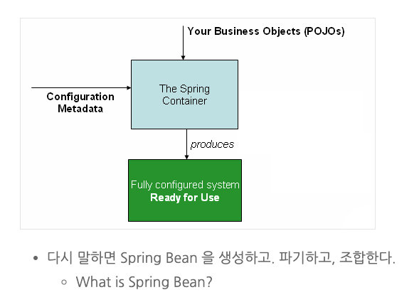
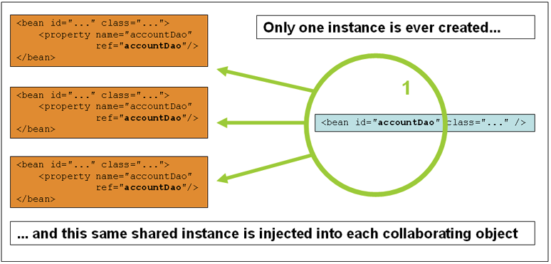
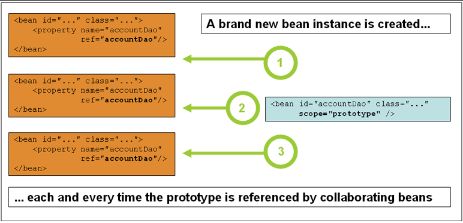
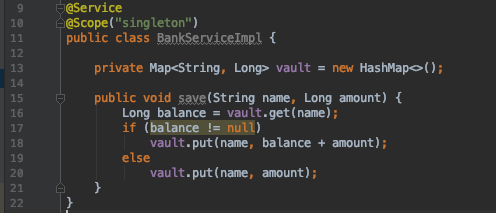

# Spring Bean 설정

## Spring Bean

- 애플리케이션을 설정하기 위해서 사용하는 Spring Bean
  - @Configuration + @Bean
  - Meta 설정의 포멧이 Java 이면, JavaConfig 방식이라 한다.
- 비지니스 로직을 처리하는 Spring Bean
  - @ComponentScan + Stereotype Annotation
- 스프링 빈은 `이름`, `타입`, `객체` 로 구성되어있다.

## Spring Bean

- 기억해봅시다.
  - 스프링 빈을 생성, 파기, 조합한다.



# JavaConfig 와 Spring Bean

## JavaConfig를 이용한 Spring Bean 생성 - 01

- @Bean 과 @Configuration 사용법
  - Meta 정보, 타입, 이름, 객체

```java
@Configuration
public class JavaConfig {
    @Bean/*(name = "dbms")*/
    public String dbms() {
        return new String("MYSQL");
    }
}
```

- JavaConfig 의 관례

## JavaConfig를 이용한 Spring Bean 생성 - 02

- BeanDefinition interface 를 이용한 방법

```java
StaticApplicationContext context = new StaticApplicationContext();
context.registerBeanDefinition("notificationService", new RootBeanDefinition(SmsServiceImpl.class));
    
NotificationService notificationService = NotificationService.class.cast(context.getBean("notificationService"));
notificationService.sendNotification("01099499102", "Welcome to Dooray Service ");
    
context.close();
```

## JavaConfig를 이용한 Spring Bean 주입 - 01

- 메서드 파라미터 전달

```java
@Configuration
public class JavaConfig {
    @Bean
    public ARepository aRepository() {
        return new ARepositoryImpl();
    }

    @Bean
    public AService aService(ARepository aRepository) {
        return new ASergice(aRepository);
    }
}
```

## JavaConfig를 이용한 Spring Bean 주입 - 02

- 메서드 호출

```java
@Configuration
public class JavaConfig {
    @Bean
    public ARepository aRepository() {
        return new ARepositoryImpl();
    }

    // with method parameter
    @Bean
    public AService aService() {
        return new ASergice(aRepository());
    }
}
```

# Annotation 과 Spring Bean

## Annotation을 이용한 Bean Scanning

- Q. 실제로 XML 이나 Java 클래스에 비지니스 로직을 포함한 모든 bean을 일일이 등록해서 사용해야 하나요?
- Bean Scanning 을 이용한 방법
  - `Bean Scanning = Componenent Scanning = Classpath Scanning`
- 사용방법

```java
@ComponentScan(basePackages="...")
```

## Stereotype Annotations

- Bean Scanning 의 대상이 되는 어노테이션들
  - @Component
  - @Controller
  - @Service
  - @Repository

## Stereotype Annotations을 이용한 Spring Bean 생성

- Stereotype Annotation에 bean 이름을 설정하는 방법

```java
@Service(name = "kakaoService")
@Service("kakaoService")
```

## Demo

- package scan

```
git checkout feature/component_scan
```

- marking class scan

```
git checkout feature/component_scan2
```

## Stereotype Annotations을 이용한 Spring Bean 주입

- Field Injection
- Setter Injection
- Constructor Injection

## Field Injection

- @Autowired - byType
- @Qualifier - byName
- demo

```
git checkout feature/bean_injection_autowired
```

## Setter Injection

- demo

```
git checkout feature/bean_injection_setter
```

## Constructor Injection

- demo

```
git checkout feature/bean_injection_constructor
```

# Spring Bean Scope

## Bean Scope - 01

- singleton - **default**

- prototype

- **Only valid** in the context of a **web-aware** Spring ApplicationContext
- request - lifecycle of a single HTTP request
  - session - lifecycle of an HTTP Session
- application - lifecycle of a ServletContext
  - websocket - lifecycle of a WebSocket
- ~~global session~~ - portlet (dropped in spring 5)

## Bean Scope - 02

- Singleton
  
- Prototype
  

## Bean Scope - 03

- 이런!
  

# Bean Lifecycle handling

## JSR-250: Common Annotations for the Java Platform

- @PostConstruct / @PreDestroy

## bean init-method, destroy-method

- @Bean(initMethod="") / @Bean(destroyMethod="")

## implement InitializingBean / DisposableBean interfaces

```java
public interface InitializingBean {
    void afterPropertiesSet() throws Exception;
}
public interface DisposableBean {
    void destroy() throws Exception;
}
```

## demo

```shell
git checkout feature/bean_construct_destroy
```

## 그 외

- @Primary
  - 의존성 주입 대상에 여러 후보 Spring Bean 이 존재하면, @Primary 애너테이션이 있는 Spring bean 이 주입된다.
- demo

```shell
git checkout feature/bean_injection_primary
```

## practice

```
git checkout feature/all_together
```
