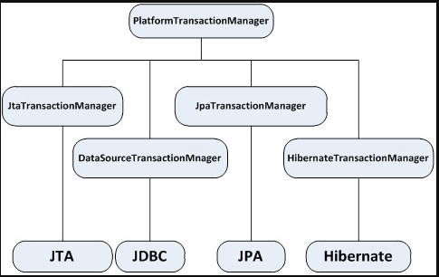

# Environment 추상화

## Environment

> Environment Interface 는 애플리케이션 환경 설정을 위한 2개의 중요한 모델을 추상화한것이다.

- Profiles
- Properties

## Environment interface

```java
public interface Environment extends PropertyResolver {
  String[] getActiveProfiles();

  String[] getDefaultProfiles();

  boolean acceptsProfiles(Profiles profiles);
}
public interface PropertyResolver {
  boolean containsProperty(String key);

  String getProperty(String key);

  String getProperty(String key, String defaultValue);

  // ..
}
```

## Profiles

- Profiles
  - Spring Bean 그룹의 이름이다.
- java command line option
  - spring.profiles.active

```properties
-Dspring.profiles.active=dev,korea
```

## Profiles - demo

- `@Profile`

```
git checkout feature/profile_environment
```

- default profile

```
git checkout feature/profile_environment2
```

- practice

```
git checkout feature/profile_environment3
```

## @PropertySource

- PropertySource를 Environment에 추가하기 위한 선언적 메커니즘을 제공
- Property를 가지고 있는 Source
  - Properties
  - Map

```java
public abstract class PropertySource<T> {
	protected final String name;
	protected final T source;
    
    // ...
}
```

## demo

- `@PropertySource` + Environment

```shell
git checkout feature/property_source
```

- `@PropertySource` + `@Value("${...}")`

```shell
git checkout feature/property_source2
```

## Properties - PropertySourcesPlaceholderConfigurer

- `PropertySourcesPlaceholderConfigurer` is designed as a general replacement for
- `PropertyPlaceholderConfigurer`

- demo

```shell
git checkout feature/propertyplaceholderconfigurer
```

## Properties - 별도의 Properties Bean으로 등록하는 방법

- demo

```shell
git checkout feature/properties_bean
```

- cf.) Spring Boot
  - @ConfigurationProperties

# Portable Service Abstraction (PSA, 서비스 추상화)

## 서비스 추상화

- 성격이 비슷한 여러 종류의 기술을 일관된 방법으로 사용할 수 있도록 해주는 일
  - Transaction Management
  - Cache Abstraction
  - Mail Service Abstraction
  - ...

## Spring 트랜잭션 서비스 추상화



- JtaTransactionManager
  - JTA와 분산/글로벌 트랜잭션
- DataSourceTransactionManager
  - JDBC driver & javax.sql.DataSource 를 사용하는 일반적인 TxManager
- JpaTransactionManager
  - DataSource와 EntityManagerFactory를 지정
- HibernateTransactionManager
  - Hibernate SessionFactory 를 지정

## 트랜잭션 예제

- 트랜잭션 처리가 안 되는 경우

### demo

```
git checkout feature/transaction
```

## PlatformTransactionManager

```java
public interface PlatformTransactionManager {
    TransactionStatus getTransaction(TransactionDefinition definition) throws TransactionException;

    void commit(TransactionStatus status) throws TransactionException;

    void rollback(TransactionStatus status) throws TransactionException;
}
```

- Transaction 처리는 TransactionDefinition, TransactionStatus 객체 정보를 참고한다.

## TransactionDefinition

- name
- isolation level
  - DEFAULT(-1),
  - READ_UNCOMMITTED(1),
  - READ_COMMITTED(2),
  - REPEATABLE_READ(4),
  - SERIALIZABLE(8);
- timeout
- propagation
  - REQUIRED(0),
  - SUPPORTS(1),
  - MANDATORY(2),
  - REQUIRES_NEW(3),
  - NOT_SUPPORTED(4),
  - NEVER(5),
  - NESTED(6);
- read only

## TransactionStatus

```java
public interface TransactionStatus extends SavepointManager, Flushable {
  boolean isNewTransaction();

  boolean isRollbackOnly();

  boolean isCompleted();

  // ...

}
```

- TransactionDefinition 와 TransactionStatus 를 사용하여 Transaction 의 begin, commit, rollback 를 구현할 수 있다.

## 트랜잭션 예제

- 트랜잭션 적용

```shell
git checkout feature/transaction2
```

- persistence layer 구현 변경

```shell
git checkout feature/transaction3
```