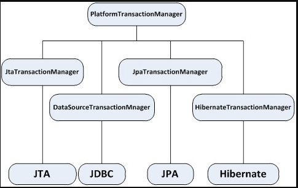
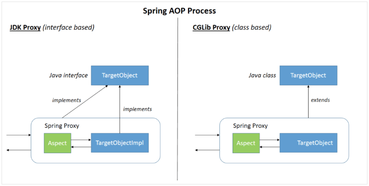

# [TOAST FORWARD] 하루에 정리하는 Spring Framework Core


## 왜 Spring Framework 인가?

- 생산성
- 품질
- 사실상 표준인 Java 프레임워크
- 엔터프라이즈 애플리케이션에 적합한 Java 프레임워크
  - 엔터프라이즈 애플리케이션이란?
  - Spark framework


### EJB와 Spring Framework

- Spring은 EJB보다 가볍다.
- 비침투적 프레임워크
- POJO
- 오픈소스
- 경향 솔루션
- 모듈러 프레임워크


### Spring Framework

#### 특징

- 경량 컨테이너로서, Spring Bean 을 직접 관리한다.
  - Spring Bean 객체의 라이프 사이클을 관리한다
  - `Containter` - Spring Bean 객체의 생성, 보관, 제거에 관한 모든일을 처리한다.
- POJO 기반의 프레임워크
  - 일반적인 J2EE 프레임워크와 비교하여, 특정한 인터페이스를 구현하거나 상속을 받을 필요가 없다.
  - 기존에 존재하는 라이브러리를 사용하기 편리하다.
  - 원하는 라이브러릴 넣어서 사용할 수 있다.
- 제어 판전 패턴(IoC)
  - 의존성 주입 구현 방법 사용
  - 낮은 결합도로 인한 DDD, TDD와 같은 프로그래밍 개발론에도 적합함
- 관점 지향 프로그래밍을 지원
  - 복잡한 비지니스 영역의 문제와 공통된 지원 영역의 문제를 분리할 수 있음
  - 문제 해결을 위한 집중
  - E.g, Transaction, Loggin, Security And etc
- 영속성과 관련된 다양한 서비스 지원
  - e.g, Mybatis, Hibernate, JdbcTemplate 등등
- **높은 확장성 및 범용성 그리고 Eco System**


### 모듈

#### Core Container

- spring-core
- spring-context
- spring-context-support
- spring-beans
- spring-expression


#### AOP

- spring-aop
- spring-aspects

#### 

#### Data Access/Integration, Web, Test

- spring-jdbc
- spring-jms
- 등등


### Spring Boot

#### 스프링 부트와 스프링 프레임워크는 무엇이 틀린가?

- 설정을 하지 않아도 바로 사용할 수 있는 프로젝트


#### Ioc/DI 개념

> 하나의 클래스가 다른 클래스의 메소드를 사용하는 관계를 의존성이라고 한다.

- 객체 지향 프로그래밍의 개념
- 프로그래밍에서 구성 요소간의 의존관계가 소스코드 내부가 아닌 외부의 설정파일 등을 통해 정의되게 하는 디자인 패턴 중의 하나
- 선언적 의존성에서 실행적 의존성으로 변경됨


#### Bean

- 스프링 컨테이너에서 관리되는 자바 오브젝트
- name, type, object로 구성되어있다

JavaBeans과는 다르다.


### ApplicationContext

- ~xml~ApplicationContext
- ~AnnotationConfig~ApplicationContext
- ~Grooby~ApplicationContext
- ~Web~ApplicationContext


## Spring Bean

- 애플리케이션을 설정하기 위해서 사용하는 Spring Bean
  - @Configuration + @Bean
  - Meta 설정의 포맷이 Java 이면, JavaConfig 방식이라고 한다.
- 비지니스 로직을 처리하는 Spring Bean
  - @ComponentScan + Stereotype Annotation
- 스프링 빈은 `이름`, `타입`, `객체` 로 구성되어있다.

모든 Bean을 일일이 등록해서 사용하기 어려우니 Bean Scanning을 이용한다.

- `Bean Scanning = Componenent Scanning = Classpath Scanning`


### Stereotype Annotations

- Bean Scanning 의 대상이 되는 어노테이션들
  - @Component
  - Component를 상속하고 있는 어노테이션
    - @Controller
    - @Service
    - @Repository


### Stereotype Annotations을 이용한 Spring Bean 주입

- Field Injection
- Setter Injection
- Constructor Injection


#### Field Injection

- @Autowired - byType
- @Qualifier - byName

#### Setter Injection

#### Constructor Injection

테스트를 Mocking할때 편한 Constructor Injection을 추천한다.


### Bean Scope

#### 종류

- singleton - **default**
- prototype
- Only valid in the context of a web-aware Spring ApplicationContext
  - request - lifecycle of a single HTTP request
  - session - lifecycle of an HTTP Session
  - application - lifecycle of a ServletContext
  - websocket - lifecycle of a WebSocket
  - global session - portlet (dropped in spring 5)

싱글턴은  ApplicationContext에서 유일한 것이다. JVM에서 유일한 것은 아니다.

#### 주의사항

멤버변수 선언시 Threaf Safe하게 만들어야한다.


# Environment 추상화

### Environment

> Environment Interface 는 애플리케이션 환경 설정을 위한 2개의 중요한 모델을 추상화한것이다.

- Profiles
- Properties

#### Environment interface

```java
public interface Environment extends PropertyResolver {
  String[] getActiveProfiles();

  String[] getDefaultProfiles();

  boolean acceptsProfiles(Profiles profiles);
}
public interface PropertyResolver {
  boolean containsProperty(String key);

  String getProperty(String key);

  String getProperty(String key, String defaultValue);

  // ..
}
```


### Profiles

- Profiles
  - Spring Bean 그룹의 이름이다.
- java command line option
  - spring.profiles.active

```properties
-Dspring.profiles.active=dev,korea
```

`@Profile` 어노테이션을 사용하여 설정에 따라 배포되는 Bean을 주입할 수 있다.


### Portable Service Abstraction (PSA, 서비스 추상화)

#### 서비스 추상화

- 성격이 비슷한 여러 종류의 기술을 일관된 방법으로 사용할 수 있도록 해주는 일
  - Transaction Management
  - Cache Abstraction
  - Mail Service Abstraction


#### Spring 트랜잭션 서비스 추상화



- JtaTransactionManager
  - JTA와 분산/글로벌 트랜잭션
- DataSourceTransactionManager
  - JDBC driver & javax.sql.DataSource 를 사용하는 일반적인 TxManager
- JpaTransactionManager
  - DataSource와 EntityManagerFactory를 지정
- HibernateTransactionManager
  - Hibernate SessionFactory 를 지정


추상화를 이용해 기존 코드를 수정안해고 구현체를 쉽게 변경할수있다. 


## Aspect-Oriented Programming (AOP, 관점 지향 프로그래밍)

### AOP is

- AOP란 프로그램 구조를 다른 방식으로 생각하게 함으로써 OOP를 보완한다
- OOP에서 모듈화의 핵심단위는 클래스이지만 AOP에서 모듈화의 핵심단위는 관점(aspect)이다
- 관점은 다양한 타입과 객체에 걸친 트랜잭션 관리같은 관심(concern)을 모듈화할 수 있게 한다
  - crosscutting concerns: 횡단 관심사


### Spring Framework에서 AOP 사용의 예

- Transaction Management
- Cache Abstraction

비 기능적 요구사항을 AOP로 처리할 수 있다.


### Ex.) Transaction Management

#### @Transactional

- Transaction 을 AOP 로 구현한 대표적인 예제
- org.springframework.transaction.interceptor.TransactionInterceptor가 `@Transactional` 어노테이션이 부여된 메소드에 트랜잭션 적용

```java
TransactionInfo txInfo = createTransactionIfNecessary(tm, txAttr, joinpointIdentification);
Object retVal = null;
try {
    // This is an around advice: Invoke the next interceptor in the chain.
    // This will normally result in a target object being invoked.
    retVal = invocation.proceedWithInvocation();
}
catch (Throwable ex) {
    // target invocation exception
    completeTransactionAfterThrowing(txInfo, ex);
    throw ex;
}
finally {
    cleanupTransactionInfo(txInfo);
}
commitTransactionAfterReturning(txInfo);
return retVal;
```


private은 위빙할 수 없다.(SPRING AOP)


## Spring AOP



JDK Proxy는 Interface가 반드시 필요하다.


AOP를 적용할때 애노테이션을 만들어서 적용하자. 그냥 사용한다면 다른 사용자가 AOP적용한 부분에 대해 알기 어렵다.


## 링크

- https://nhnent.dooray.com/share/posts/YhZXrT4MRL6TFHMalXX5LQ 
- https://nhnent.dooray.com/share/posts/XIU5FMn1RHOMFHxOWyztvQ
- https://nhnent.dooray.com/share/posts/s7RaqXy9RsixVyLlIbt59w
- https://nhnent.dooray.com/share/posts/vOmcp29ZTKqBwPlm7McPtQ 


### 